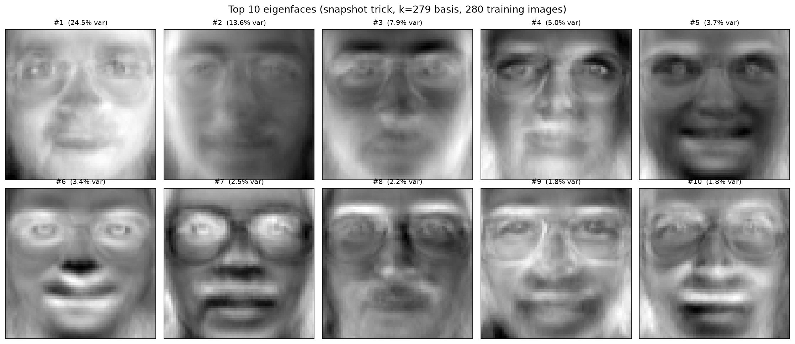
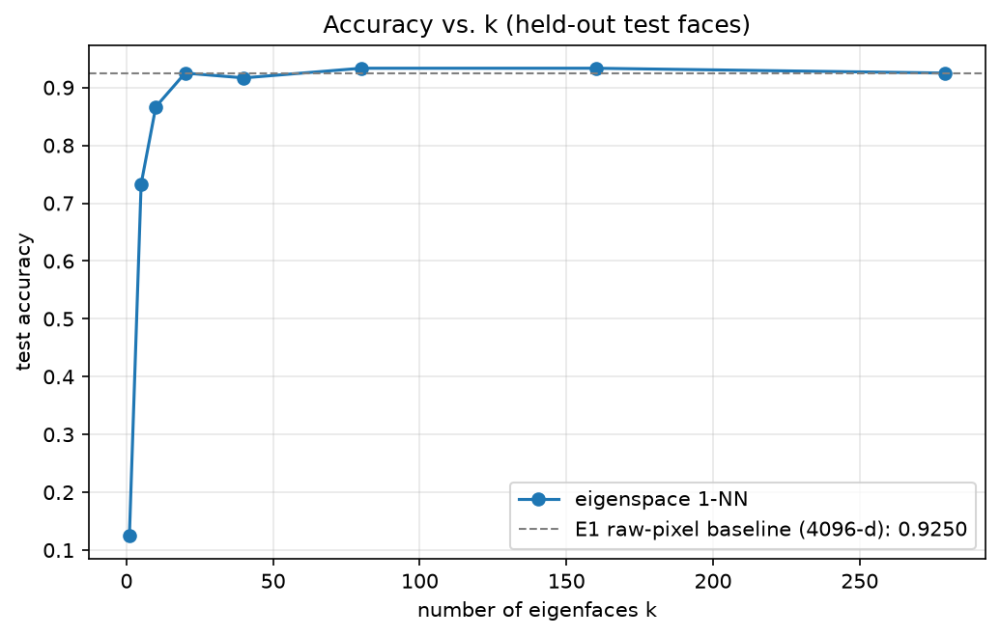
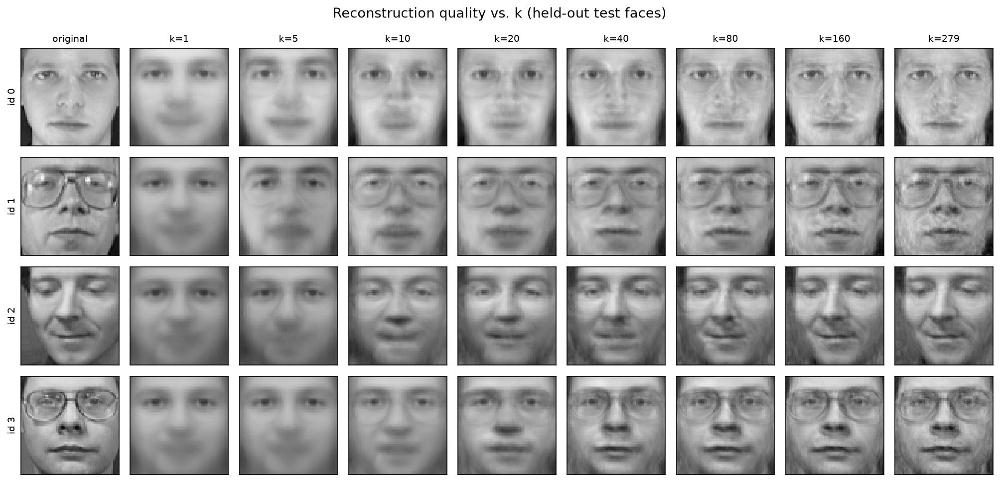
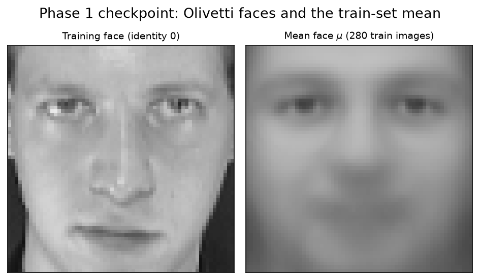

# Eigenfaces — PCA face recognition from scratch

A from-scratch implementation of PCA-based face recognition (Turk & Pentland,
1991) on the Olivetti faces dataset — no `sklearn.decomposition`, no scipy,
just numpy. Every number below is produced by a committed script and
reproduces exactly from a fixed seed.

## The claim, measured

**1-NN on raw 4096-dimensional pixels scores 0.9250. The same 1-NN in a
20-dimensional eigenspace scores 0.9250.** PCA matches the raw-pixel baseline
while compressing 4096 → 20 dimensions (~205×), and peaks at 0.9333 around
k = 80–160.

| Experiment | Result |
|---|---|
| E1 — raw-pixel baseline | 0.9250 accuracy at 4096-d (chance: 0.0250) |
| E2 — accuracy vs. k | matches the baseline at **k=20**, peaks **0.9333** at k=80–160 |
| E3 — reconstruction | test MSE falls monotonically 0.0149 (k=1) → 0.0017 (k=279) |



The top ten eigenfaces of the training set. The first two are visibly
lighting gradients rather than identities — evidence that the leading
components encode illumination, which the E5 ablation (planned) will
quantify.

## Results

Measured on Olivetti (400 images, 40 identities, 64×64), stratified
7 train / 3 test per identity (`seed=0`, 280 train / 120 test), mean and
eigenfaces fit on the training split only. Full per-experiment tables:
[`results/results.md`](results/results.md).

### E2 — accuracy vs. k (the central result)

| k | 1 | 5 | 10 | 20 | 40 | 80 | 160 | 279 |
|---|---|---|---|---|---|---|---|---|
| Accuracy | 0.1250 | 0.7333 | 0.8667 | **0.9250** | 0.9167 | **0.9333** | **0.9333** | 0.9250 |

Accuracy plateaus from k=20 onward (111–112 of 120 test faces). The
single-face drops at k=40 and k=279 are held-out quantization (one face =
0.83% of the test set), not a decomposition bug — the checklist was verified
clean: eigenvalues descend monotonically,
`max |C u − λu| = 3.1e-15` in pixel space, and reconstruction MSE (same
bases) is monotone.



### E3 — reconstruction vs. k

| k | 1 | 5 | 10 | 20 | 40 | 80 | 160 | 279 |
|---|---|---|---|---|---|---|---|---|
| Test MSE | 0.014872 | 0.008965 | 0.007108 | 0.005233 | 0.003763 | 0.002807 | 0.002118 | 0.001707 |



### E1 — the baseline to beat

1-NN on raw flattened pixel vectors — no PCA, no centering: **0.9250**
accuracy at 4096 dimensions, 2.17 ± 0.69 ms/query (mean ± stdev across 5
repeated sweeps of 120 single-query calls; wall-clock timing is the only
number in this repo that is machine-load sensitive, so it is reported with
its variance).

### The from-scratch decomposition, verified against brute force

The snapshot trick exists to avoid eigendecomposing the 4096×4096 covariance
matrix — so the decomposition is validated against exactly that matrix,
computed in full: over the top 10 eigenfaces,
`max |C u − λu| = 1.25e-15`, and orthogonality is
`max |U Uᵀ − I| = 5.4e-14` at the rank ceiling k=279. Variance explained by
the top-k basis: 24.5% (k=1), 66.3% (k=10), 85.9% (k=40), 97.9% (k=160).

## How it works

1. **Load & flatten.** 400 images of 64×64 → `X ∈ R^(400×4096)`.
2. **Split.** Stratified, 7 train / 3 test per identity, fixed seed
   (280 train / 120 test).
3. **Center.** Subtract the *training* mean μ. Mean and eigenfaces are fit
   on the training split only, then applied to test — fitting on all 400
   images would be data leakage.
4. **Snapshot trick.** Eigendecompose `L = (1/n) X̃ X̃ᵀ` (280×280) instead
   of `C = (1/n) X̃ᵀ X̃` (4096×4096). If `L v = λ v`, then
   `u = X̃ᵀ v` — normalized to unit length — is an eigenvector of `C` with
   the same eigenvalue. Since `rank(C) ≤ n − 1 = 279`, there are at most
   279 meaningful eigenfaces despite 4096 dimensions.
5. **Project.** `w = U_kᵀ (x − μ)` — a k-dimensional coordinate vector.
6. **Reconstruct.** `x̂ = μ + U_k w`.
7. **Classify.** 1-NN by Euclidean distance between weight vectors.
8. **Reject.** The reconstruction residual `‖x − x̂‖` (distance from face
   space) against a threshold calibrated on a held-out per-identity slice
   of the training set: ~4–8% of genuine test faces fall below the bar at
   the operating `k`, while noise images are rejected ~100% of the time.
   1-NN always returns *something*; this is what makes "unknown" a possible
   answer.

**PCA is SVD.** The economy SVD `X̃ = U Σ Vᵀ` gives `L = U (Σ²/n) Uᵀ`, so
the eigenvectors of `L` are the left singular vectors, and the eigenfaces
`u = X̃ᵀ v / σ` are the right singular vectors. The snapshot trick is the
standard SVD trick of eigendecomposing the smaller Gram matrix, in disguise.



The mean face: 280 training images averaged. Everything downstream is
relative to this vector.

## Repository layout

```
src/            the library — data, eigensolver, model, classify
                (corrupt/align/gallery are stubs for the robustness and demo phases)
experiments/    one script per experiment; each writes figures/ and appends to results/
figures/        generated figures, committed as they are produced
results/        results.md — one section per experiment, append-only
notebook.ipynb  narrative walkthrough (planned)
app.py          Streamlit demo (planned)
```

The core `src/` pipeline deliberately depends on **numpy and matplotlib
only**. scikit-learn is used solely to fetch the dataset and make the
stratified split; OpenCV is confined to the (planned) demo path. The
hand-written PCA is the point of the project, not incidental plumbing —
`sklearn.decomposition.PCA` would answer "no" to the question being asked.

## Getting started

```bash
python -m venv .venv && source .venv/bin/activate
pip install -e ".[dev,demo]"
```

Run the test suite and the experiments:

```bash
pytest                                    # one test file per src/ module

python experiments/exp_baseline.py        # E1 — raw-pixel baseline
python experiments/exp_accuracy_vs_k.py   # E2 — accuracy vs. k
python experiments/exp_reconstruction.py  # E3 — reconstruction vs. k
```

Each experiment writes its figure(s) to `figures/` and appends a dated row
to its own section in `results/results.md` (append-and-annotate: a superseded
row is kept, not overwritten). All accuracy/MSE numbers reproduce exactly
from the fixed seed on a clean checkout.

## Status

**Done** — the mandatory core, independently reproducible end to end:

- `src/data.py` — Olivetti loading, stratified 7/3 split, flattening,
  centering on the training mean.
- `src/eigensolver.py` — `solve_eigh` and the `solve` dispatcher.
- `src/model.py` — `EigenfaceModel` (fit / transform / reconstruct /
  residual) via the snapshot trick, with rank and `k` validation.
- `src/classify.py` — Euclidean 1-NN and distance-from-face-space rejection
  with a threshold calibrated on held-out training identities.
- Experiments E1–E3 with the four figures above, and the full test suite.

**Next** — the code is in the repo as stubs and lands in this order:

- Robustness suite (E4): shift / rotation / brightness / occlusion / noise,
  applied to the test set only, accuracy per level.
- Ablations (E5/E6): drop the first 3 eigenfaces (they encode lighting);
  whitening on/off.
- Power-iteration solver (E7): from-scratch, validated against `eigh`
  at k=10 before any higher `k`.
- Enrollment demo (E8) + Streamlit app: eye-point alignment, lighting
  normalization, enrolling identities the model never saw.
- Narrative notebook.

Streamlit demo, once it exists: `streamlit run app.py`.

